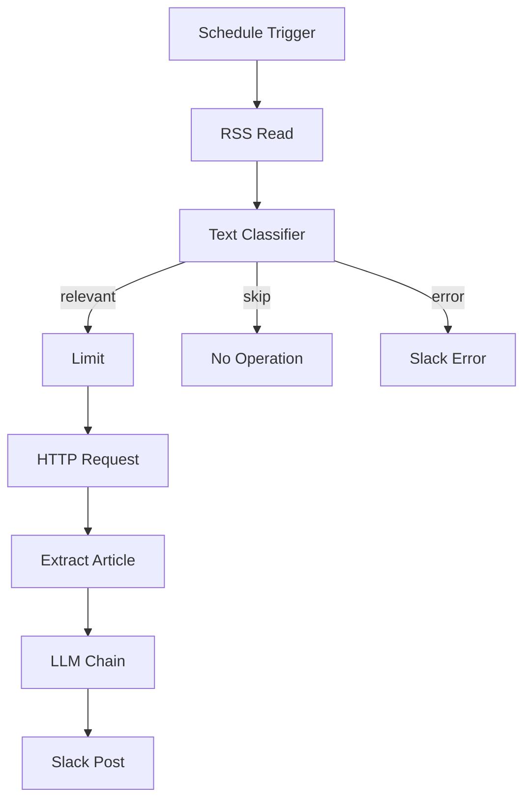

# 📰 ITニューストレンド自動投稿ワークフロー（修正前）

> **⚠️ これは修正前のドラフト版です。既知の不具合が含まれています。**
> 修正済みバージョンは `../修正後/` を参照してください。

---

## 概要

Yahoo Japan IT ニュースの RSS フィードを **24時間ごとに自動取得**し、AI（Gemini）で記事を分類・要約・オピニオン生成して **Slack に投稿**する n8n ワークフロー。

| 項目 | 内容 |
|---|---|
| **トリガー** | スケジュール（24時間ごと） |
| **データソース** | Yahoo Japan IT ニュース RSS |
| **AI モデル** | Google Gemini 2.5 Flash Lite |
| **出力先** | Slack `#テスト通知` チャンネル |
| **フィルター** | AI関連ニュースのみ処理 |

---

## ⚙️ ノード構成

| ノード名 | タイプ | 役割 |
|---|---|---|
| Schedule Trigger | scheduleTrigger | 24時間ごとに起動 |
| RSS Read | rssFeedRead | Yahoo IT RSSを取得 |
| Text Classifier | textClassifier (LangChain) | AI関連かどうかを分類 |
| Google Gemini Chat Model1 | lmChatGoogleGemini | Classifier用LLM |
| Limit | limit | 処理件数を制限 ⚠️ *未設定* |
| No Operation, do nothing | noOp | 非AI記事をスキップ |
| Send a message | slack | Classifier エラー通知 |
| HTTP Request | httpRequest | 記事URLのHTMLを取得 |
| Extract Article Text | code | HTMLから記事本文を抽出 |
| Basic LLM Chain | chainLlm (LangChain) | 要約・オピニオン生成 |
| Google Gemini Chat Model | lmChatGoogleGemini | LLM Chain用LLM |
| Structured Output Parser | outputParserStructured | JSON形式の出力を強制 |
| Slack | slack | 結果をSlackに投稿 |

---

## 🗺️ フロー図



---

## 📨 Slack 投稿フォーマット

```
【🚨 今日のトレンドニュース】
📝 要約:
{{ LLMが生成した140文字以内の要約 }}

💡 オピニオン:
{{ LLMが生成したビジネス的示唆を含むオピニオン }}

🔗 ソース:
{{ 記事URL }}
```

---

## ⚠️ 既知の不具合（修正前の問題点）

> これらの問題が原因で、本番稼働させると誤動作・課金爆発のリスクがあります。

### 🔴 Critical（今すぐ修正が必要）

| # | 問題 | 影響 |
|---|---|---|
| 1 | **`Limit` ノードの `maxItems` が未設定** | RSS全件（30件超）がGemini APIに送られ、**APIコストが爆発する** |
| 2 | **エラーデータ `{error: '...'}` がそのままLLM Chainに流れ込む** | `Extract Article Text` が失敗してもエラーオブジェクトがGeminiに渡される |

### 🟡 Warning（修正推奨）

| # | 問題 | 影響 |
|---|---|---|
| 3 | **Slack チャンネル名の `#` 不整合** | `Slack` ノードは `テスト通知`、`Send a message` は `#テスト通知` と不統一 |
| 4 | **`HTTP Request` に `onError` 未設定** | スクレイピング失敗（404/403）でワークフロー全体が停止 |
| 5 | **`Basic LLM Chain` に `onError` 未設定** | Geminiのレート制限・タイムアウトでワークフロー全体が停止 |
| 6 | **Structured Output Parserのスキーマ内にn8n式混入** | `"source_url": "{{ $json.articleUrl }}"` は評価されず文字列リテラルになる |

### 🟢 Suggestion（任意改善）

| # | 問題 | 影響 |
|---|---|---|
| 7 | **`endIndex === -1` のガード節なし** | `</script>` が見つからないとき `html.slice(..., -1)` になり誤動作 |
| 8 | **Global Error Trigger なし** | 予期しない停止時にアラートが飛ばない |

---

## 🔧 技術スタック

- **n8n** - ワークフロー自動化プラットフォーム
- **Google Gemini 2.5 Flash Lite** (`models/gemini-2.5-flash-lite`) - AI分類・生成
- **LangChain ノード** - Text Classifier / LLM Chain / Structured Output Parser
- **Yahoo Japan RSS** - `https://news.yahoo.co.jp/rss/topics/it.xml`
- **Slack API** - 通知出力

---

## 📁 ファイル構成

```
X_present_post_workflow/
├── 修正前/
│   ├── workflow修正前.json   ← このワークフロー（不具合あり）
│   └── README.md            ← このファイル
└── 修正後/
    └── workflow修正後.json   ← 修正済みバージョン
```
