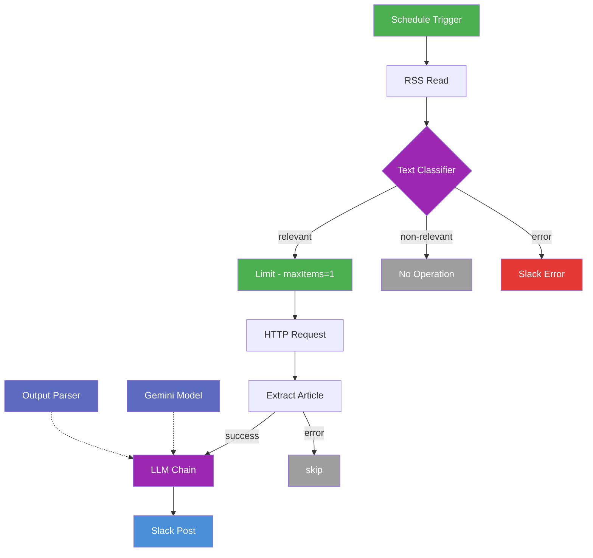

# ITニューストレンド自動投稿ワークフロー（修正後）

> **このバージョンは修正済みの本番稼働版です。**
> 修正前のドラフト版は `../修正前/` を参照してください。

---

## 概要

Yahoo Japan IT ニュースの RSS フィードを **24時間ごとに自動取得**し、AI（Gemini）で記事を分類・要約・オピニオン生成して **Slack に投稿**する n8n ワークフロー。

| 項目 | 内容 |
|---|---|
| **トリガー** | スケジュール（24時間ごと） |
| **データソース** | Yahoo Japan IT ニュース RSS |
| **AI モデル** | Google Gemini 2.5 Flash Lite |
| **出力先** | Slack `テスト通知` チャンネル |
| **フィルター** | AI関連ニュース 上位1件のみ処理 |

---

## 修正前からの変更点

| # | ノード | 修正内容 | 修正前の問題 |
|---|---|---|---|
| 1 | **Limit** | `maxItems: 1` を設定 | 未設定でRSS全件がAPIに流れAPIコスト爆発 |
| 2 | **HTTP Request** | `retryOnFail: true`, `maxTries: 2`, `onError: continueRegularOutput` を追加 | 失敗時にワークフロー全体が停止 |
| 3 | **Basic LLM Chain** | `retryOnFail: true`, `onError: continueRegularOutput` を追加 | Geminiレート制限で全体停止 |
| 4 | **Extract Article Text** | `onError: continueErrorOutput` に変更 + `startIndex`, `endIndex` のガード節追加 | エラーデータがそのままLLMに流れ込んでいた |
| 5 | **Structured Output Parser** | `source_url` スキーマ例を固定値に修正 | `{{ $json.articleUrl }}` が式として評価されず文字列リテラルになっていた |
| 6 | **Send a message** | チャンネル名を `テスト通知`（`#`なし）に統一 | Slackと`Send a message`でチャンネル名の`#`有無が不統一 |

---

## フロー図



---

## ノード構成

| ノード名 | タイプ | 役割 | エラー設定 |
|---|---|---|---|
| Schedule Trigger | scheduleTrigger | 24時間ごとに起動 | - |
| RSS Read | rssFeedRead | Yahoo IT RSSを取得 | - |
| Text Classifier | textClassifier (LangChain) | AI関連かどうかを分類 | retryOnFail / continueErrorOutput |
| Google Gemini Chat Model1 | lmChatGoogleGemini | Classifier用LLM | - |
| Limit | limit | **上位1件に制限** | - |
| No Operation, do nothing | noOp | 非AI記事をスキップ | - |
| Send a message | slack | Classifier エラー通知 | - |
| HTTP Request | httpRequest | 記事URLのHTMLを取得 | **retryOnFail x2 / continueRegularOutput** |
| Extract Article Text | code | HTMLから記事本文を抽出（ガード節あり） | **continueErrorOutput** |
| Basic LLM Chain | chainLlm (LangChain) | 要約・オピニオン生成 | **retryOnFail / continueRegularOutput** |
| Google Gemini Chat Model | lmChatGoogleGemini | LLM Chain用LLM | - |
| Structured Output Parser | outputParserStructured | JSON形式の出力を強制 | - |
| Slack | slack | 結果をSlackに投稿 | - |

---

## Slack 投稿フォーマット

```
【🚨 今日のトレンドニュース】
📝 要約:
{{ LLMが生成した140文字以内の要約 }}

💡 オピニオン:
{{ LLMが生成したビジネス的示唆を含むオピニオン }}

🔗 ソース:
{{ 記事URL }}
```

---

## Codeノード（Extract Article Text）の修正内容

修正後のガード節：

```javascript
// 修正前: エラーデータをpushしてLLMに流していた
if (startIndex === -1) {
  results.push({ json: { error: 'PRELOADED_STATE not found' } });
  continue;
}

// 修正後: ログを出してスキップ（LLMに流さない）
if (startIndex === -1) {
  console.log('PRELOADED_STATE not found for item:', item.json.link);
  continue;
}

// 修正後: endIndex のガード節を追加
if (endIndex === -1) {
  console.log('End script tag not found for item:', item.json.link);
  continue;
}
```

---

## 技術スタック

- **n8n** - ワークフロー自動化プラットフォーム
- **Google Gemini 2.5 Flash Lite** (`models/gemini-2.5-flash-lite`) - AI分類・生成
- **LangChain ノード** - Text Classifier / LLM Chain / Structured Output Parser
- **Yahoo Japan RSS** - `https://news.yahoo.co.jp/rss/topics/it.xml`
- **Slack API** - 通知出力

---

## ファイル構成

```
X_present_post_workflow/
├── 修正前/
│   ├── workflow修正前.json   ← 不具合ありドラフト
│   └── README.md
└── 修正後/
    ├── workflow修正後.json   ← このワークフロー（本番稼働版）
    └── README.md            ← このファイル
```
